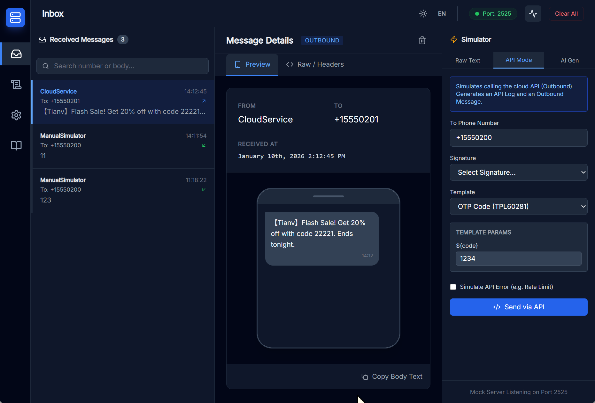

# SMS4Dev

<div align="center">
  
</div>

<br />

<div align="center">
  English | [中文](README_zh-CN.md)
</div>

<br />

**SMS4Dev** is a developer-friendly tool designed to simulate and test SMS functionalities. It provides a comprehensive interface for managing messages, templates, and signatures, along with real-time logging capabilities, making it an essential utility for developers working with SMS integrations.

### Key Features

- **📨 SMS Simulation**: Simulate sending and receiving SMS messages without real-world costs.
- **📊 Message History**: Automatically save and retrieve message history using a built-in SQLite database.
- **📝 Templates & Signatures**: Create, edit, and manage SMS templates and signatures for standardized testing.
- **🔍 API Logs**: Monitor API requests and responses in real-time to debug integrations effectively.
- **⚡ Real-time Updates**: Built with Socket.io to provide instant UI updates upon message events.
- **🐳 Docker Ready**: Fully containerized and ready for deployment via Docker Hub.

### Quick Start with Docker

The application is published on Docker Hub. You can pull and run it with a single command:

```bash
docker run -d -p 5081:5081 boyce6280/sms4dev
```

Once the container is running, open your browser and navigate to:
[http://localhost:5081](http://localhost:5081)

### Local Development

If you prefer to run the code locally or contribute to the project:

1.  **Clone the repository**:
    ```bash
    git clone https://github.com/your-username/sms4dev.git
    cd sms4dev
    ```

2.  **Install dependencies**:
    ```bash
    # Install frontend dependencies
    npm install
    
    # Install server dependencies
    cd server
    npm install
    cd ..
    ```

3.  **Run the application**:
    You need to run the backend and frontend in separate terminals.

    **Terminal 1 (Backend):**
    ```bash
    cd server
    npm start
    ```
    The server will start on port 5081.

    **Terminal 2 (Frontend):**
    ```bash
    npm run dev
    ```
    The frontend will start on http://localhost:3000.

### License

This project is released under the [MIT License](LICENSE).
